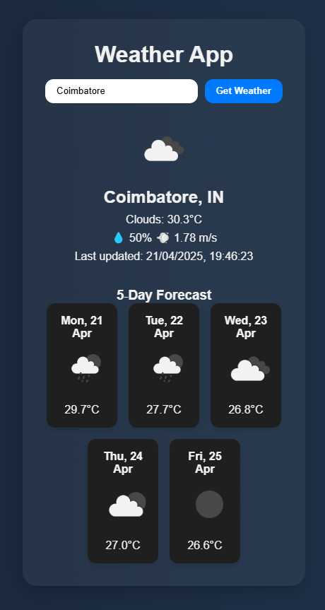

# 🌦️ Weather App

A sleek and simple weather web application that displays real-time weather conditions and a 5-day forecast using the OpenWeatherMap API. Built using HTML, CSS, and JavaScript — this app is responsive and easy to use.

---

## 📌 Features

- 🌍 Search any city worldwide
- 🌡️ View current temperature, weather status, humidity, and wind speed
- 🕔 Get a 5-day forecast with icons and temperature
- 🌘 Dark/Light mode toggle
- 📱 Mobile responsive design
- ⚠️ Error handling for invalid city names

---

## 🚀 Live Demo

👉 [Click here to view the app live](https://arjumaan.github.io/weather-app/) *(replace with actual URL after deployment)*

---

## 🛠️ Tech Stack

- **HTML5**
- **CSS3**
- **JavaScript (Vanilla)**
- **OpenWeatherMap API**

---

## 🖼️ Screenshots

  
*Add more screenshots if needed.*

---

## 📥 Getting Started

### 1. Clone the repository

```bash
git clone https://github.com/Arjumaan/weather-app.git
cd weather-app
